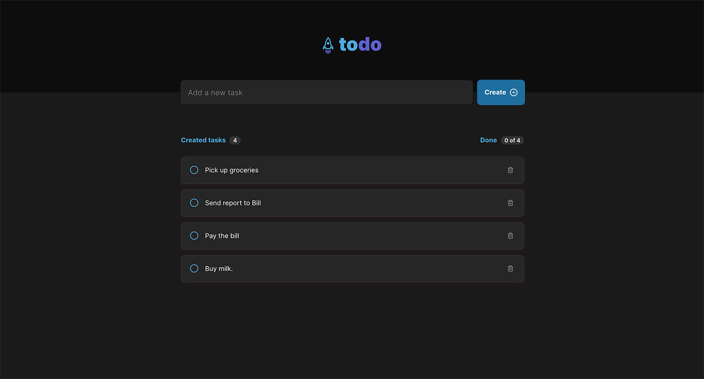
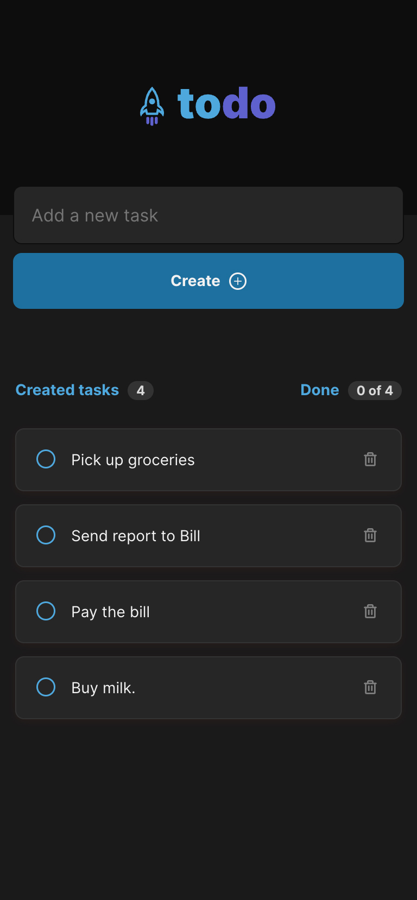

<p align="center">
  
</p>
<p align="center">	
  
  
  <a href="https://github.com/fernandotag/todo-list/commits/main">
    
  </a> 
  
  
</p>

This application is a simple todo list app.

You can:
- list tasks
- create new task
- delete task
- set task as done

👉 Link to access: [https://todo-list-fernandotag.vercel.app/](https://todo-list-fernandotag.vercel.app)

## Layout


<br />


### Tecnologies

- ReactJS
- Typescript
- SCSS
- HTML

## How to run
**1.** Clone this project
```
git clone git@github.com/fernandotag/todo-list
``` 
**2.** Open the project folder todo-list in your system's shell
```
cd todo-list
``` 
**3.** install the project's dependencies
```
npm install
```
**4.** run the app
```
npm run dev
```

## License

Released in 2021 :closed_book: License

This project is under the [MIT license](./LICENSE).

Give a ⭐️ if this project helped you!
